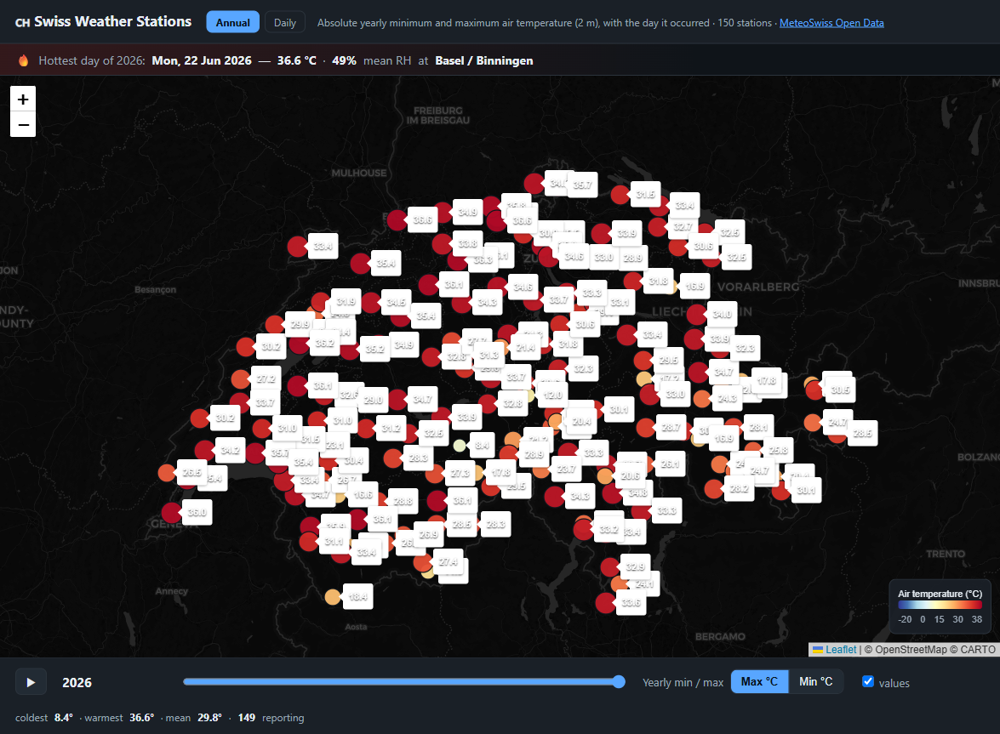

# 🇨🇭 Swiss Historical Weather — Temperature Maps

A **static website generator** written in pure Ruby (standard library only) that
builds interactive maps of Switzerland showing the minimum and maximum air
temperature at every [SwissMetNet](https://www.meteoswiss.admin.ch) automatic
weather station. It produces **two pages**:

| Page | Slider | Shows |
| --- | --- | --- |
| `index.html` (default) | year | **absolute yearly** min / max temperature (back to ~1864), **plus the exact day the extreme occurred** |
| `daily.html` | day | **daily** min / max temperature over the last few years |

Stations are coloured by temperature and labelled with the value. Click any
station for details, hit **▶** to animate, toggle between **Max** and **Min**,
or use the **← →** arrow keys. Both pages share one Leaflet template, switched
by an `Annual | Daily` nav.

The annual page also shows a headline banner for the selected year:
**🔥 the hottest day** (and **❄️ the coldest** when viewing Min) anywhere in the
country — date, temperature and station — and each station's popup names the day
its yearly extreme was reached.

### Annual extremes (`index.html` — default)


### Daily (`daily.html`)


## Data source

Data comes from the [MeteoSwiss Open Government Data](https://opendatadocs.meteoswiss.ch)
service (collection `ch.meteoschweiz.ogd-smn`), free to use with attribution:

| What | File |
| --- | --- |
| Station metadata (coordinates, canton, altitude) | `ogd-smn_meta_stations.csv` |
| Daily values per station (current year) | `{abbr}/ogd-smn_{abbr}_d_recent.csv` |
| Daily values per station (full history) | `{abbr}/ogd-smn_{abbr}_d_historical.csv` |

Both pages are built from the **daily** parameters `tre200dn` (daily min) and
`tre200dx` (daily max), 2 m above ground. The annual extremes — and the date
each one occurred — are computed by reducing the daily series per year, so the
value and its day always agree. The mean relative humidity (`ure200d0`) of each
extreme day is carried along too, and shown for the hottest/coldest day of the
year and in each station's popup.

## Usage

Build the site (no gems required — the generator is pure stdlib):

```bash
ruby generate.rb          # builds ./public (index.html, daily.html, data.json)
```

Preview it locally with the bundled [Puma](https://puma.io) server:

```bash
bundle install
bundle exec puma -p 8000   # then open http://localhost:8000
```

(`config.ru` serves `./public` via `Rack::Static`.)

### Configuration (environment variables)

| Variable | Default | Description |
| --- | --- | --- |
| `DAILY_YEARS` | `5` | How many recent years the **daily** page covers |
| `OUTPUT_DIR` | `public` | Output directory |
| `THREADS` | `12` | Parallel download workers |
| `MAX_STATIONS` | _all_ | Limit number of stations (handy for quick local tests) |

```bash
DAILY_YEARS=10 THREADS=16 ruby generate.rb     # daily page covers last 10 years
MAX_STATIONS=10 ruby generate.rb               # fast test build (few stations)
```

> The **annual** page always uses each station's full daily history, so every
> build downloads the complete historical daily archive (a few hundred MB across
> all stations). `DAILY_YEARS` only trims how much of that ends up on the daily
> page.

## Deployment (GitHub Pages)

`.github/workflows/deploy.yml` builds and publishes the site automatically:

* on every push to `main`,
* on a daily schedule (05:30 UTC) so the map keeps refreshing with new data,
* manually via **Run workflow** (you can set how many years the daily page covers).

To enable it: in your repository go to **Settings → Pages → Build and
deployment → Source: GitHub Actions**. The next push (or the manual trigger)
publishes the map to `https://<user>.github.io/<repo>/`.

## How it works

1. Download the station metadata CSV and parse coordinates (WGS84).
2. Download each station's full daily history in parallel (recent + historical).
3. Reduce the daily series two ways: keep the last `DAILY_YEARS` for the daily
   page, and collapse it to per-year min/max **with the date each occurred** for
   the annual page. A nationwide hottest/coldest day is picked per year.
4. Build a compact JSON payload per page (a global axis — dates or years — plus
   per-station aligned arrays, `null` where a value is missing).
5. Render two self-contained pages (`index.html` = annual, `daily.html`) with
   the data embedded inline, from one axis-aware ERB template: a
   [Leaflet](https://leafletjs.com) map, a colour scale, a slider and an
   animation player. The only difference between the pages is whether the slider
   steps over days or years.

The generator itself needs **no gems** — just `ruby generate.rb`. Puma/Rack
(in the `Gemfile`) are only for local preview.

## Licence

Code: MIT. Weather data: © MeteoSwiss, Open Government Data.
