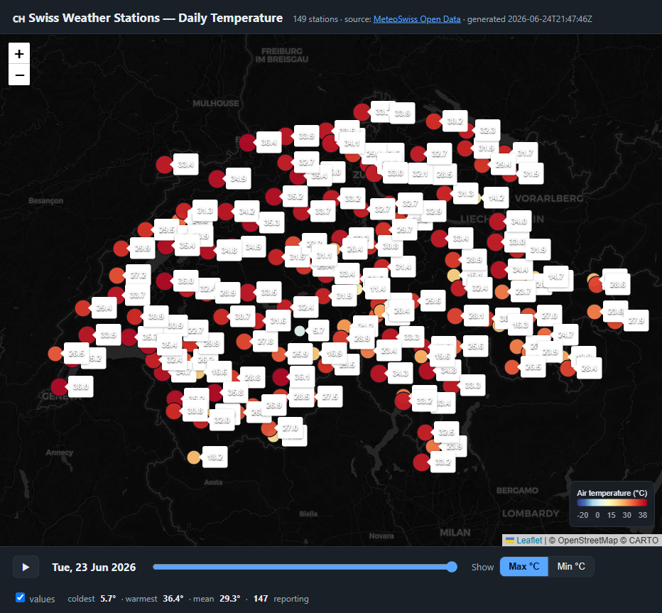

# 🇨🇭 Swiss Historical Weather — Daily Temperature Map

A **static website generator** written in pure Ruby (standard library only) that
builds an interactive map of Switzerland showing the **daily minimum and maximum
air temperature** at every [SwissMetNet](https://www.meteoswiss.admin.ch)
automatic weather station.

A day **slider** lets you scrub through the year; stations are coloured by
temperature and labelled with the value. Click any station for details, hit
**▶** to animate, or toggle between **Max** and **Min**.



## Data source

Data comes from the [MeteoSwiss Open Government Data](https://opendatadocs.meteoswiss.ch)
service (collection `ch.meteoschweiz.ogd-smn`), free to use with attribution:

| What | File |
| --- | --- |
| Station metadata (coordinates, canton, altitude) | `ogd-smn_meta_stations.csv` |
| Daily values per station (current year) | `{abbr}/ogd-smn_{abbr}_d_recent.csv` |
| Daily values per station (full history) | `{abbr}/ogd-smn_{abbr}_d_historical.csv` |

Temperature parameters used: `tre200dn` (daily min) and `tre200dx` (daily max),
2 m above ground.

## Usage

```bash
ruby generate.rb          # builds ./public (index.html + data.json)
```

Then open `public/index.html` through any static web server, e.g.:

```bash
python3 -m http.server 8000 --directory public   # http://localhost:8000
```

### Configuration (environment variables)

| Variable | Default | Description |
| --- | --- | --- |
| `SMN_DATASET` | `recent` | `recent` (current year), `historical` (full archive), or `both` |
| `OUTPUT_DIR` | `public` | Output directory |
| `THREADS` | `12` | Parallel download workers |
| `MAX_STATIONS` | _all_ | Limit number of stations (handy for quick local tests) |

```bash
SMN_DATASET=both THREADS=16 ruby generate.rb   # full historical archive
MAX_STATIONS=10 ruby generate.rb               # fast test build
```

## Deployment (GitHub Pages)

`.github/workflows/deploy.yml` builds and publishes the site automatically:

* on every push to `main`,
* on a daily schedule (05:30 UTC) so the map keeps refreshing with new data,
* manually via **Run workflow** (you can choose the dataset).

To enable it: in your repository go to **Settings → Pages → Build and
deployment → Source: GitHub Actions**. The next push (or the manual trigger)
publishes the map to `https://<user>.github.io/<repo>/`.

## How it works

1. Download the station metadata CSV and parse coordinates (WGS84).
2. Download each station's daily CSV in parallel and extract min/max temperature
   per day.
3. Build a compact JSON payload (a global date axis + per-station aligned arrays).
4. Render a single self-contained `index.html` (data embedded inline) using an
   ERB template with a [Leaflet](https://leafletjs.com) map, a colour scale, a
   day slider and an animation player.

No build tools, no gems, no database — just `ruby generate.rb`.

## Licence

Code: MIT. Weather data: © MeteoSwiss, Open Government Data.
